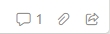

# Microsoft/SharePoint List Formatting

## List Column Formatting

### Document Libraries

[Promoted State](./ColumnFormatting/Promoted_State.json), makes the *Site Pages* document library's `Promoted State` column human readable (Site Page, Unpublished News, Published News vs. 0, 1, 2).

### List Item View

[Multi Person Assign To Me](./ColumnFormatting/Multi_Person_Assign_To_Me.json) is for an *Assigned To* column that accepts multiple assignees and when blank has a "+ Assign to me" link.

[Single Person Message](./ColumnFormatting/Single_Person_Message.json) is for a single person column, it shows the person's name and has buttons to Teams message and email the person.  It also shows the person's details card when hovering their name.


### (Kanban) Board View

[Comments and Attachments](./BoardForm/Comments_and_Attachments.json) - show the number of comments and whether there are attachments.




## More

### Checking Variables

A super simple snippet to paste in to play with [expressions](https://learn.microsoft.com/en-us/sharepoint/dev/declarative-customization/formatting-syntax-reference#expressions), [special string values](https://learn.microsoft.com/en-us/sharepoint/dev/declarative-customization/formatting-syntax-reference#special-string-values) and column references.
```json
{
  "$schema": "https://developer.microsoft.com/json-schemas/sp/v2/column-formatting.schema.json",
  "elmType": "span",
  "txtContent": "=@currentField + ' <- the value'"
}
```

### Snippets

#### ID + Title
A simple ID + Title for emails & such  
`"=[$ID] + ' - ' + [$Title]"` -> "23 - My Cool List Item"  

#### Setting a Date/Time Column to the current time
It needs an ISO string, so: `=getYear(@now)+'-'+padStart(toString(getMonth(@now)+1),2,'0')+'-'+padStart(toString(getDate(@now)),2,'0') + 'T' + toLocaleTimeString(@now)`

#### Custom Hover/Click Card

This gets added to the element that click on or hovering over will enable it.
```json
"customCardProps": {
    "isBeakVisible": true,
    "openOnEvent": "click",
    "directionalHint": "rightCenter",
    "formatter": {
        "elmType": "div",
        "style": { "min-width": "200px", "min-height": "200px" },
        "children": [ /* The elements that will make up your card here :) */ ]
    }
}
```

#### For Each

For each choice item in the column `[$Label]` make a span with the choice's text content
```json
{
    "elmType": "span",
    "forEach": "label in [$Label]",
    "txtContent": "[$label]"
}
```

#### Icons!

Find available icons [here](https://developer.microsoft.com/en-us/fluentui#/styles/web/icons#available-icons)!
```json
{
    "elmType": "span",
    "attributes": {
        "iconName": "Attach"
    }
}
```

### Documentation

* [PnP List Formatting Samples](https://pnp.github.io/List-Formatting/)  

Microsoft Learn
* [List Formatting Syntax Reference](https://learn.microsoft.com/en-us/sharepoint/dev/declarative-customization/formatting-syntax-reference)  
* [Column Formatting](https://learn.microsoft.com/en-us/sharepoint/dev/declarative-customization/column-formatting)  

