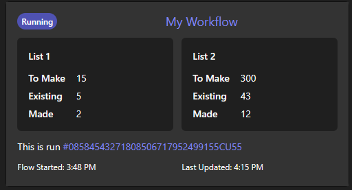
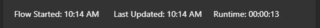

# Microsoft's Adaptive Cards


### Templates

[List Counter](./templates/ListCounter.json)  
  


[Loading](./templates/Loading.json) a super basic card that can be updated later  

[Weather](./templates/weather.json) nicely formats the results from an MSN Weather `Get forecast for today`  
Wants the variable: 'Timezone'

### Snippets

[Flow Name With Badge](./snippets/TitleWithBadge.json)  
Its probably good to replace the whole button with a variable  

[Runtime Info](./snippets/RuntimeInfo.json)  
Wants the variables: 'Time Started' and 'Timezone'  
  

[Run info button](./snippets/RunInfoButton.json) - A button to show more about the current run  
Will need `#InfoContainer`'s `items: []` replaced


### Elements

Pasteable power automate flow elements

#### Variables

[Time Started](./elements/Variable_Time_Started.json), useful for in-flow reporting.  Uses `trigger()?['startTime']`  
[Timezone](./elements/Variable_Timezone.json), useful for making outputed dates nice to read [non-comprehensive list](https://learn.microsoft.com/windows-hardware/manufacture/desktop/default-time-zones)   
#### Meta Info Compose

Or you can stick everything into one compose element with:
```json
{
    "startTime": "@{utcNow()}",
    "triggerTime": "@{trigger()?['startTime']}",
    "timezone": "https://learn.microsoft.com/en-us/dotnet/api/microsoft.azure.management.monitor.models.timewindow.timezone?view=azure-dotnet-legacy",
    "link": {
        "flow": "@{concat('https://make.powerautomate.com/environments/', workflow()?['tags']['environmentName'], '/flows/', workflow()?['name'])}",
        "run": "@{concat('https://make.powerautomate.com/environments/', workflow()?['tags']['environmentName'], '/flows/', workflow()?['name'],'/runs/',workflow()?['run']['name'])}"
    }
}
```
