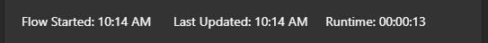

# Microsoft's Adaptive Cards

### Templates

[List Counter](./templates/ListCounter.json)  
  

[Loading](./templates/Loading.json) a super basic card that can be updated later  

[Weather](./templates/weather.json) nicely formats the results from an MSN Weather `Get forecast for today`  
Wants the variable: 'Timezone'

### Snippets

[Flow Name With Badge](./snippets/TitleWithBadge.json)  
Its probably good to replace the whole button with a variable  

[Runtime Info](./snippets/RuntimeInfo.json)  
Wants the variables: 'Time Started' and 'Timezone'  
  

[Run info button](./snippets/RunInfoButton.json) - A button to show more about the current run  
Will need `#InfoContainer`'s `items: []` replaced

