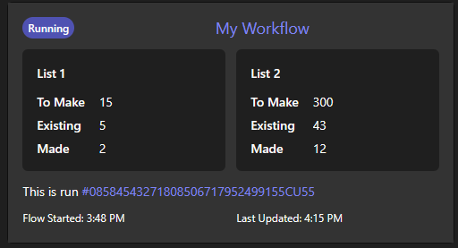

# Microsoft's Adaptive Cards


### Templates

[List Counter](./templates/ListCounter.json) 


### Snippets


[Runtime Info](./snippets/RuntimeInfo.json) - wants the variables: 'Time Started' and 'Timezone'

[Flow Name With Badge](./snippets/TitleWithBadge.json) - Its probably good to replace the whole button with a variable

```json

        {
            "colorSet": "diverging",
            "data": [
                {
                    "x": "Created",
                    "y": @{variables('DataCard_Progress_Value') }
                },
                {
                    "x": "Required",
                    "y": @{variables('DataCard_Progress_Max') }
                }
            ],
            "type": "Chart.HorizontalBar",
            "displayMode": "AbsoluteNoAxis"
        },
```
